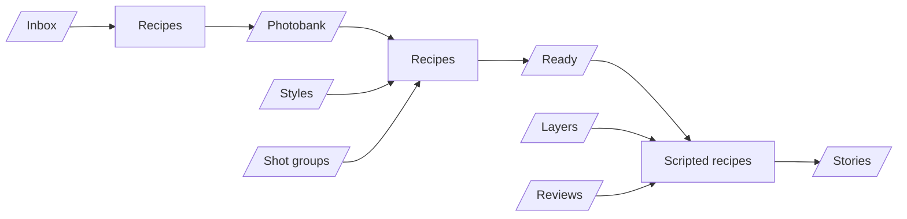

# Rocketbox

Rocketbox handles marketing for small businesses while owners keep doing their craft.

## Product

**Pitch:** We handle marketing for you while you work.

**Loop (once live):**
1. One-time setup — crawl the business website and social presence
2. Owner sends media during the day (Telegram or WhatsApp; more connectors later)
3. Fully automated Instagram publishing — Reels, Stories, and feed posts
4. Owner can delete anything they dislike after it goes live (typically after work)

**Not the homepage story:** Setup/run mechanics stay off the public marketing surface. Ads target specific verticals (barbershops, salons, etc.); the site speaks to “your business.”

**Current go-to-market:** Public CTA is “Get started for free” at `/sign_up` ([signups](/app/controllers/signups_controller.rb)), which starts onboarding in WhatsApp. Public pricing lives at `/pricing` ([tiers](/app/controllers/pricing_controller.rb)); plan CTAs also go to `/sign_up`.

**Proof / examples:** Use-case pages under `/use-cases/:slug` ([registry](/app/controllers/use_cases_controller.rb)), with real barbershop demos reused on the home page.

**SMM media pipeline:** How SMM media gets produced, drawn live from the recipes at `/app/overview` ([controller](/app/controllers/accounts/overview_controller.rb)): folders hold media, recipes read from folders and write to a folder (scripted recipes to Stories). Styles, shot groups, layers and reviews are drawn as folders too. Laid out with dagre in [flow_controller](/app/javascript/controllers/flow_controller.js).

**Folders** ([model](/app/models/folder.rb), browsed at `/app/library/:root(/:child)`): one global table. Top-level folders (Inbox and Photobank are seeded) hold subfolders one level below (`inbox/interior`, `photobank/logo`). Ready is `photobank/ready`, the default recipe output. Every media is in exactly one folder; recipe inputs and outputs point at folders.

**Transformations** ([model](/app/models/transformation.rb), types under [transformation/](/app/models/transformation/)): a named processing step (type, prompt, options, style, shot group, layer steps; a recipe's own takes the recipe's name), a shared row reusable outside recipes, edited at `/app/transformations` ([controller](/app/controllers/accounts/transformations_controller.rb)). Its type is picked from the "Add transformation" menu (or the new recipe form) and fixed once created. A recipe is inputs + a transformation + output; every run is a `TransformationRun`, its recipe optional.

**Workflows** ([model](/app/models/workflow.rb), edited at `/app/workflows` ([controller](/app/controllers/accounts/workflows_controller.rb))): a graph of folder nodes and transformation step nodes, joined by edges; each step owns its transformation (never a recipe's), made blank from the type dropped from the palette and deleted with the step; one end of an edge is always a step, so a folder feeding a step is an input and one a step feeds is an output. A folder node can hold only its media with a tag. A media node is a source that always gives that one media: it feeds steps, nothing connects into it. Edited on the overview's flow canvas ([workflow_controller](/app/javascript/controllers/workflow_controller.js)): drag folders and transformation types in from the bottom palette (each tab has its own search), and a selected folder's media from the inspector, drag nodes around (positions saved; Alt-drag drops a copy, a step's with its own copy of the transformation, without connections) or the empty canvas to pan, drag from a node's dot to another node to connect (nodes it can connect to light up), and click a node to open the inspector on the right (remove, and a step's transformation settings), or a connection to remove it or drag its ends to other nodes; Delete removes whichever is selected, and clicking the empty canvas deselects. Run mode (`?run=`, [model](/app/models/workflow_run.rb)): a play button on a start folder or media (one feeding steps that nothing feeds) replays the workflow's draft run, keeping each step's execution while it took the same inputs and its transformation wasn't saved since, so only changed steps and the steps after them rerun; a play button on a finished step's corner forces it to rerun (e.g. after its type's code changed), and the steps after it follow. The start node's media (a folder's newest) goes to the steps it feeds, and each step starts once every node feeding it gives media: a folder its newest media, a media itself, a step what it made in this run. Each step execution is a `TransformationRun`, and its result lands in the step's output folder (Ready if none). Each step node shows its execution's status as a corner badge (working, complete, failed). The bottom panel then lists the executions with their inputs, output, status and time, and the inspector shows the selected node's inputs and outputs in the selected run (a step's also its status and how long it took) instead of its edit controls. One draft run per workflow for now; the run pills switch between runs.

**Tags** ([model](/app/models/tag.rb), managed in ActiveAdmin): global labels on media, many per media, shown as `#name` pills ([partial](/app/views/accounts/tags/_tag.html.erb)) and edited on the media page. A recipe tags what it makes (`output_tag_ids`), and an input can take only media with a tag (`inputs[].tag_id`).

## Production
- URL: https://rocketbox.plus
- Runner: `bin/kamal app exec --reuse "bin/rails runner '...'"` (aliases: `bin/kamal console`, `shell`, `logs`; see [DEPLOY.md](./docs/DEPLOY.md)).

## Dev
- Local: http://localhost:3003 (`bin/dev`)
- Tunnel (public webhooks): https://dev.rocketbox.plus (`make tunnel`)
- Don't use the browser to test changes unless the user explicitly asks.

**No backwards compatibility.** The service is new and still in the making — no active users yet. Prefer deleting and reshaping over redirects, aliases, or dual-path support.

## UI / Tailwind
Prefer built-in scale utilities over arbitrary values (`rounded-[10px]`, `min-w-[10rem]`, `px-[18px]`, …). Use the nearest step (`rounded-lg`, `min-w-40`, `px-4.5`). Keep arbitrary values only when nothing on the scale fits (e.g. mockup micro-type, email `max-w-[600px]`, one-off layout heights).

## Vocabulary
- **Island** — a standalone content panel, usually styled `rounded-2xl border border-ink-900/10 bg-white p-6`.
- **Workflow** — a graph of nodes and edges (the definition).
- **Node** — a folder, media or step on the canvas. A **step** is a node owning its transformation.
- **Edge** — a connection between two nodes, one end always a step ("connection" in the UI).
- **Start folder** — a folder or media that feeds steps and that nothing feeds; play starts a run from it.
- **Run** (`WorkflowRun`) — one execution of a workflow.
- **Step run** (`TransformationRun` in a run, `WorkflowRun#step_runs`) — one execution of a step; its result lands in the step's output folder.

# Documentation Index

### [STRIPE.md](./docs/STRIPE.md)
Payments and billing via Stripe.

### [TELEGRAM.md](./docs/TELEGRAM.md)
Telegram bot: inbound media, webhooks, outbound messaging.

### [WHATSAPP.md](./docs/WHATSAPP.md)
WhatsApp Cloud API: inbound media, webhooks, outbound messaging.

### [LOGIN.md](./docs/LOGIN.md)
Authentication and session login.

### [DEPLOY.md](./docs/DEPLOY.md)
How the app is deployed and operated in production.

### [PROMPTS.md](./docs/PROMPTS.md)
LLM prompts: content `Recipe` rows at `/app/recipes`; service prompts are constants in code.

### [PRICE_BANDS.md](./docs/PRICE_BANDS.md)
How AI models get their £ / ££ / £££ price band: per-image and per-second cost estimates.

### [ICONS.md](./docs/ICONS.md)
Heroicons: `heroicon "name"` — no variant or size unless needed.
