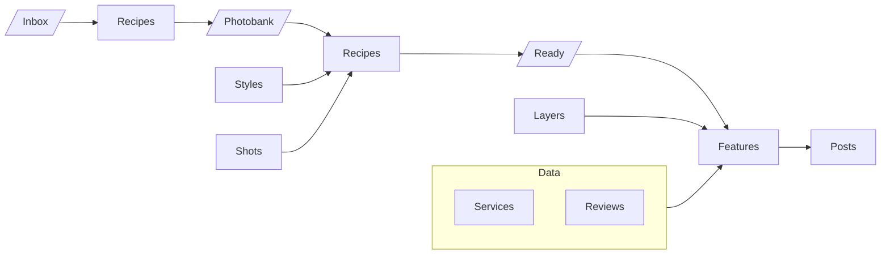

# Rocketbox

Rocketbox handles marketing for small businesses while owners keep doing their craft.

## Product

**Pitch:** We handle marketing for you while you work.

**Loop (once live):**
1. One-time setup — crawl the business website and social presence
2. Owner sends media during the day (Telegram or WhatsApp; more connectors later)
3. Fully automated Instagram publishing — Reels, Stories, and feed posts
4. Owner can delete anything they dislike after it goes live (typically after work)

**Not the homepage story:** Setup/run mechanics stay off the public marketing surface. Ads target specific verticals (barbershops, salons, etc.); the site speaks to “your business.”

**Current go-to-market:** Public CTA is “Get started for free” at `/sign_up` ([signups](/app/controllers/signups_controller.rb)), which starts onboarding in WhatsApp. Public pricing lives at `/pricing` ([tiers](/app/controllers/pricing_controller.rb)); plan CTAs also go to `/sign_up`.

**Proof / examples:** Use-case pages under `/use-cases/:slug` ([registry](/app/controllers/use_cases_controller.rb)), with real barbershop demos reused on the home page.

**SMM media pipeline:** The user's mental model for how SMM media gets produced, drawn as a fishbone at `/app/overview` ([view](/app/views/accounts/overview/show.html.erb)). Folders hold media; blocks transform it; side inputs feed a step. Keep the chart and this diagram in sync.

**Folders** ([model](/app/models/folder.rb), browsed at `/app/library/folders/:root(/:child)`): one global table. Inbox, Photobank and Ready are fixed roots; subfolders sit one level below (`inbox/interior`, `photobank/logo`). Every media is in exactly one folder; recipe inputs and outputs point at folders.

## Production
- URL: https://rocketbox.plus
- Runner: `bin/kamal app exec --reuse "bin/rails runner '...'"` (aliases: `bin/kamal console`, `shell`, `logs`; see [DEPLOY.md](./docs/DEPLOY.md)).

## Dev
- Local: http://localhost:3003 (`bin/dev`)
- Tunnel (public webhooks): https://dev.rocketbox.plus (`make tunnel`)

**No backwards compatibility.** The service is new and still in the making — no active users yet. Prefer deleting and reshaping over redirects, aliases, or dual-path support.

## UI / Tailwind
Prefer built-in scale utilities over arbitrary values (`rounded-[10px]`, `min-w-[10rem]`, `px-[18px]`, …). Use the nearest step (`rounded-lg`, `min-w-40`, `px-4.5`). Keep arbitrary values only when nothing on the scale fits (e.g. mockup micro-type, email `max-w-[600px]`, one-off layout heights).

## Vocabulary
- **Island** — a standalone content panel, usually styled `rounded-2xl border border-ink-900/10 bg-white p-6`.

# Documentation Index

### [STRIPE.md](./docs/STRIPE.md)
Payments and billing via Stripe.

### [TELEGRAM.md](./docs/TELEGRAM.md)
Telegram bot: inbound media, webhooks, outbound messaging.

### [WHATSAPP.md](./docs/WHATSAPP.md)
WhatsApp Cloud API: inbound media, webhooks, outbound messaging.

### [LOGIN.md](./docs/LOGIN.md)
Authentication and session login.

### [DEPLOY.md](./docs/DEPLOY.md)
How the app is deployed and operated in production.

### [PROMPTS.md](./docs/PROMPTS.md)
LLM prompts: content `Recipe` rows at `/app/recipes`; service prompts are constants in code.

### [ICONS.md](./docs/ICONS.md)
Heroicons: `heroicon "name"` — no variant or size unless needed.
